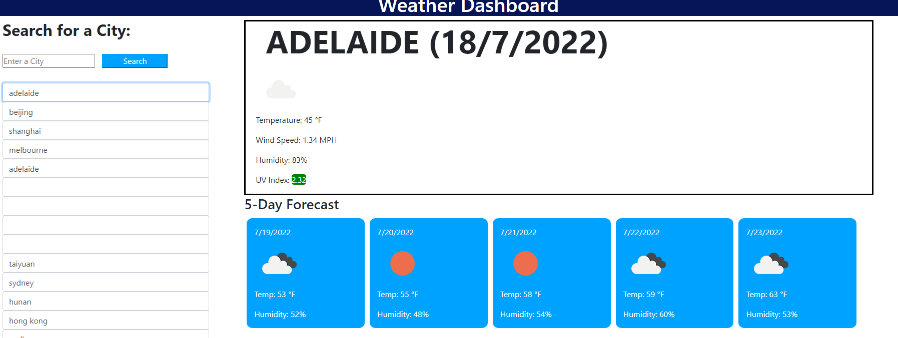

# Weather-Dashboard

# see link to the application
# https://canon70d.github.io/Weather-Dashboard/
#
# attached a overview of Weather Dashboard
# 
#
# this simple application will allow users to check weather for a city
# display current weather as well as 5 days forcast
# the search history could be saved as well just in csae users to look back 
#
# application could looks better if display a weather everytime the page load.. might work on that
